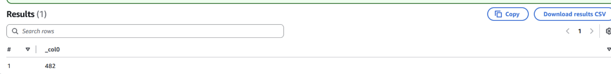
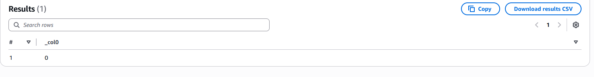
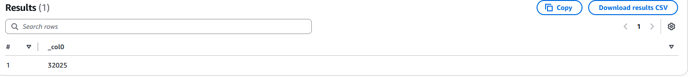
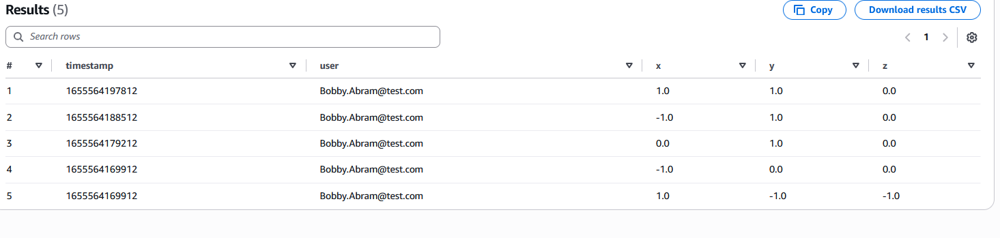

# Validation

## Customer Trusted Validation

This section validates that the `customer_trusted` table contains only customers who agreed to share their data for research purposes.

### 1. Row Count Check

**SQL Query**
```sql
SELECT COUNT(*) FROM stedi.customer_trusted;

```



---

### 2. Null Consent Validation

**SQL Query**
```sql
SELECT COUNT(*)
FROM stedi.customer_trusted
WHERE sharewithresearchasofdate IS NULL;

```



## Accelerometer Trusted Validation

This section validates that the `accelerometer_trusted` table contains only accelerometer readings from customers who agreed to share their data for research purposes.

### 1. Row Count Check

**SQL Query**
```sql
SELECT COUNT(*) FROM stedi.accelerometer_trusted;

```



---

### 2. Column Validation

This query verifies that the table contains only accelerometer fields and no customer fields.

**SQL Query**
```sql
SELECT * FROM stedi.accelerometer_trusted LIMIT 5;

```


